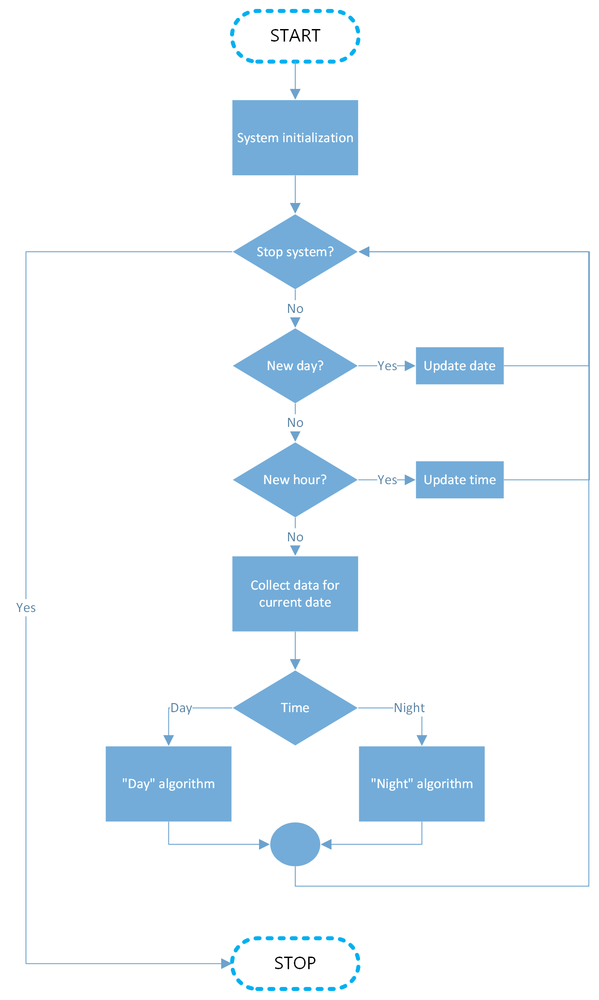

# Engineering thesis repository
### Topic
#### _An energy management system oriented on dynamic pricing for buildings with renewable energy sources and battery storage._
### Short description
_This project aims to develop an advanced multi-criteria system for efficient energy management in households equipped with photovoltaic installations and energy storage. The system will analyze real-time data from renewable energy sources, current energy consumption, and price forecasts. It will make decisions regarding energy flow direction and utilization based on predefined criteria. The scope includes proposing and implementing the algorithm, with testing using a digital twin model of a household with energy storage and photovoltaics. This research addresses the integration of building energy management systems with external energy trading platforms._

## System workflow
The general scheme is presented in the diagram below.\

  
    

1. The system's operational scope is determined.
2. The system is initialized, and the necessary resources are acquired.
3. If there is no existing management plan, one is created based on the current time.
   1. If the time is from 7 to 14 minutes, the plan is created using the `day_algorithm` (description available in `day_algorithm_pl.md`).
   2. If the time is different, the plan is created using the `night_algorithm` (description available in `night_algorithm_pl.md`).
4. The system compares the energy balance at the current time with the plan, enabling decisions regarding energy purchase, sale, and storage.
5. The system compares the energy balance at the current time with the plan, enabling decisions regarding energy purchase, sale, and storage.
6. During system operation, the total cost of energy obtained from the grid is calculated, which must be paid.
## Setup
Code is written in `python`. Required is at least `3.9` version.\
Run `.sh` script to install all required python packages and setup environment:

    chmod +x setup.sh
    sh setup.sh

## Config and logs files
Logs are kept in `logs/`\
Configs are kept in `lib/config.py`. Use this file to set needed information about files.

## Run system
To run the whole system execute:

    python main.py

