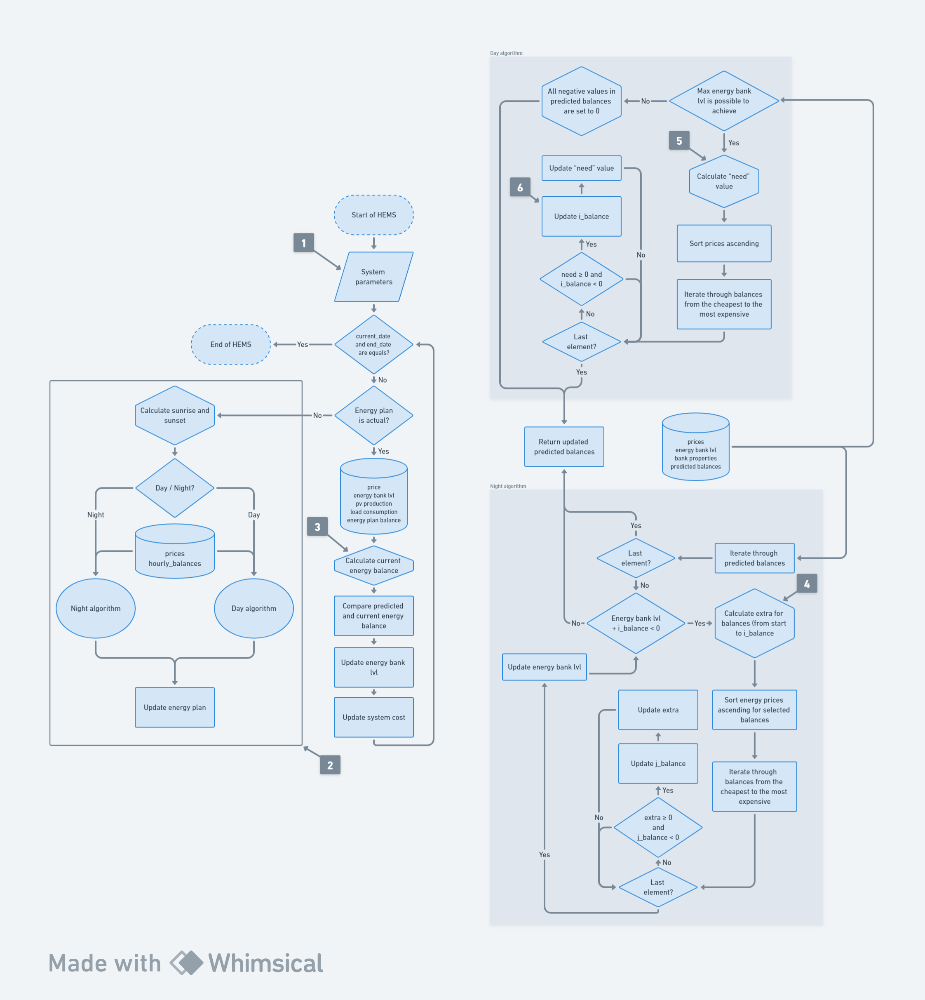

# Engineering thesis repository

### Topic

_A dynamic pricing-oriented management system for buildings equipped with renewable energy sources and energy storage._

### Short description

_This project aims to develop an advanced multi-criteria system for efficient energy management in households equipped
with photovoltaic installations and energy storage. The system analyzes data from renewable energy sources, current
energy consumption, and price forecasts. It makes decisions regarding energy flow direction and utilization based on
predefined criteria. This research addresses the integration of building energy management systems with external energy
trading platforms._

## System workflow

The general scheme is presented in the diagram below.

  
    

#### Point `1`

The system retrieves the data required to start the operation:\
`start_date` - date and time when the system started working\
`current_date` = `start_date` - current date and time of system shutdown\
`end_date` - date and time of system shutdown\
`eb_properties` - properties describing photovoltaics energy bank\
`pv_properies` - properties describing photovoltaics installation\
`load_properties` - properties describing energy consumption\

#### Point `2`

An energy plan is a strategy outlining how energy will be managed in the near future. There are two periods: the
daytime, from sunrise to sunset, and the nighttime, covering the remaining hours. Depending on the period, the plan is
created based on a different algorithm.
Algorithm input data:\
`max_b` - maximum energy value in the energy bank\
`min_b` - minimum energy value in the energy bank\
`start_b` - current energy bank lvl\
`prices` - purchase/sale prices of energy within a specific period\
`hourly_balances` - energy balances within a given period\
Output data :\
`updated_hourly_balances` - energy plan covering the period from the current time until the end of the current period.

#### Point `3`

Current energy balance is subtraction of `pv production` - `load consumption`

#### Point `4`

The `extra` value is the amount by which the energy bank should be unloaded so that its charge level decreases to a
maximum of 0.
The determination is based on the balances array from start to `i_balance`.

#### Point `5`

The `need` represents the maximum total value that needs to be achieved by manipulating the values in
the `hourly_balances` array in order to reach `max_b` at the end.

#### Point `6`

`i_balance` update is based on `need` other balances.

## Setup

Code is written in `python`. Required is at least `3.9` version.\
Run `.sh` script to install all required python packages and setup environment:

    chmod +x setup.sh
    sh setup.sh

Fill in the data in file `lib/config.py`

## Config and logs files

Logs are kept in `logs/`

Configs are kept in `lib/config.py`. Use this file to set needed values.

## Run system

To run system's gui execute:

    streamlit run app.py

To run system's code execute:

    python main.py
